# Daily Task Briefs — Web Dev Practice

This file logs the exact brief/requirements given for each day, as a reference record. Updated after each completed day.

---

## Day 1 — Profile Card
**Phase:** 1 (HTML + CSS only)
**Status:** ✅ Complete

**Brief:** Build a card showing a profile picture, name, short bio, and 3-4 social icons/links.

**Requirements:**
- Semantic HTML (`<article>` or `<section>`, not just `
` soup)
- Circular profile image (`border-radius: 50%`)
- Name as a heading, bio as a paragraph
- Social links row at the bottom
- Card: padding, subtle box-shadow, rounded corners, max-width
- Center the card on the page

**Stretch goals:** hover lift effect (`transform: translateY(-4px)` + `box-shadow`), gradient/border behind image.

**Final result:**

---

## Day 2 — Pricing Card
**Phase:** 1 (HTML + CSS only)
**Status:** ✅ Complete

**Brief:** Build 3 pricing cards side by side (Basic / Standard / Premium) using flexbox.

**Requirements:**
- Container holding 3 `.pricing-card`-style elements, `display: flex` + `gap`
- Each card: plan name, price, feature list (`<ul>`), "Choose Plan" button
- Middle/highlighted card visually distinct (border color, scale, or badge)
- Consistent card widths (`flex: 1` or fixed width)
- Responsive: `flex-wrap: wrap` for smaller screens

**What was practiced:** flexbox for row + internal card layout, visual hierarchy, shared class + modifier pattern (`.plan-name`, `.plan-price` reused across all 3 cards), flex-column + `margin-top: auto` for pinning buttons to card bottom regardless of content height, CSS specificity when two rules conflict.

**Final result:**

---

## Day 3 — Navbar
**Phase:** 1 (HTML + CSS only)
**Status:** ✅ Complete

**Brief:** Build a horizontal navbar — logo on the left, nav links on the right, with hover states.

**Requirements:**
- `<nav>` element (semantic)
- Logo/site name on the left
- 4-5 links on the right (`<ul><li><a>` pattern)
- `display: flex` + `justify-content: space-between` on `<nav>`
- Hover effect on links
- Bottom border or box-shadow separating navbar from page

**Stretch goal:** an "active" link style to simulate current-page indicator — done via a `.default` class + specificity fix.

**Final result:**

---

## Day 4 — Button Collection
**Phase:** 1 (HTML + CSS only)
**Status:** ✅ Complete

**Brief:** Build a reference sheet of 6-8 button styles (primary, secondary, outline, ghost, disabled, danger).

**Requirements:**
- Shared base class `.btn` (padding, border-radius, font-size, cursor, transition)
- Modifier classes for each variant on top of `.btn`
- Real `disabled` HTML attribute (not just a class) for the disabled button, styled via `:disabled`
- Hover + transition on all non-disabled buttons

**Stretch goal completed:** size variants `.btn-sm` / `.btn-lg`, combinable with color variants (e.g. `btn btn-primary btn-sm`) — required removing the fixed `width` from base `.btn` so size modifiers could take effect.

**Final result:**

---

## Day 5 — Blog Post Card
**Phase:** 1 (HTML + CSS only)
**Status:** ✅ Complete

**Brief:** Build a blog post preview card — thumbnail, badge/tag, title, excerpt, author/date row, "Read more →" link.

**Requirements:**
- Full-width thumbnail image, rounded to match card
- Small colored badge/tag label
- Title (proper heading level, not `<h1>`)
- 2-3 line excerpt
- Author + date row with small circular avatar, laid out with flexbox
- "Read more →" link with hover state

**Extra (user-driven, beyond original brief):** positioned the badge absolutely in the top-right corner over the thumbnail image, using `position: relative` on the card + `position: absolute` on the badge.

**Final result:**

---

## Day 6 — Testimonial Card
**Phase:** 1 (HTML + CSS only)
**Status:** ✅ Complete

**Brief:** Build a customer testimonial card — quote, star rating, author name/photo/title.

**Requirements:**
- Star rating row (plain text/unicode stars, styled with color)
- Quote using the semantic `<blockquote>` tag
- Decorative large quote mark via a `::before` pseudo-element (not typed into HTML content)
- Author row: circular avatar, bold name, muted title/company
- Standard card treatment (padding, rounded corners, shadow)

**Extra (user-driven, beyond original brief):** turned the small decorative quote mark into a large, faded "watermark" sitting behind the entire quote text, using oversized font-size + low opacity + `z-index` stacking + the `top/left: 50%` + `transform: translate(-50%, -50%)` centering trick.

**Final result:**

*(watermark quote effect, before the final -25% vertical nudge described in the notes file)*

---

## Day 7 — Alert / Notification Boxes
**Phase:** 1 (HTML + CSS only)
**Status:** ✅ Complete

**Brief:** Build 4 alert/notification box variants — success, error, warning, info.

**Requirements:**
- Icon + message per box, laid out with flexbox
- Base class (`.alert`) + modifier classes per type (`.alert-success`, `.alert-warning`, `.alert-error`, `.alert-info`)
- Light background tint + matching border + darker text color per type
- Optional close ("✕") button, non-functional for now (JS added in a later phase)

**Notable deviation (an improvement):** used `border-left` as an accent instead of a full border around the box — closer to real-world alert component patterns (e.g. Bootstrap-style alerts). Close button placed via `flex-direction: column` + `align-self: flex-end` rather than `justify-content: space-between`, which reads better for variable-length messages.

**Final result:**

---

## Day 8 — Simple Footer
**Phase:** 1 (HTML + CSS only)
**Status:** ✅ Complete

**Brief:** Build a multi-column footer with grouped links and a copyright line.

**Requirements:**
- Semantic `<footer>` wrapper (not `
`)
- 3-4 columns, each with a heading + list of links (`<ul><li><a>`)
- Columns laid out side-by-side with flexbox
- Bottom row separated from columns (e.g. `border-top`), with copyright text
- Hover effect on links
- Visually distinct footer background from the page

**Stretch goal completed:** social icons (actual images, not emoji) in the bottom row, with a hover lift effect (`translateY` + background + shadow) added beyond the brief.

**Notable deviation (a legitimate design choice):** used a light blue background rather than the traditional dark footer — a deliberate stylistic choice to stay consistent with the light color scheme used across other cards.

**Final result:**

---

## Day 9 — Login Form (static)
**Phase:** 1 (HTML + CSS only)
**Status:** ✅ Complete

**Brief:** Build a static login form — no JS validation yet, just structure and styling.

**Requirements:**
- Real `<form>` element wrapping the inputs
- Each field wrapped with a properly connected `<label for="...">` matching `<input id="...">`
- Correct input `type` (`email`/`text` for username, `password` for password)
- "Remember me" checkbox + "Forgot password?" link on the same row (flexbox)
- Full-width, prominent submit button
- Visible `:focus` states on inputs (not just relying on browser default)
- Card container consistent with other cards (padding, rounded corners, shadow, centered)

**What was practiced:** `for`/`id` label-input relationships (and why duplicate `id`s break this), input `:focus` styling as an accessibility requirement (never remove the default outline without a visible substitute), semantic tag choice for clickable text (`<a>` vs ``/`<strong>`).

**Final result:**

---

## Day 10 — CSS-only Tooltip
**Phase:** 1 (HTML + CSS only) — final day of Phase 1
**Status:** ✅ Complete

**Brief:** Build a hover-triggered tooltip using only CSS, no JavaScript.

**Requirements:**
- Trigger element + hidden-by-default tooltip box
- Tooltip appears on hover, positioned above the trigger
- Smooth fade-in via `opacity` + `transition` (not abrupt show/hide)
- Small triangular arrow pointing from tooltip to trigger, built with the CSS border-triangle trick
- 2-3 tooltips practicing the pattern (brief allowed doing just one to focus on getting the technique right first)

**What was practiced:** the hover-reveal descendant-selector pattern (`.wrapper:hover .child`), why hovering the *wrapper* rather than the trigger avoids a flicker bug when the mouse moves from trigger into the tooltip itself, `opacity` + `visibility` combined for animatable show/hide, and the CSS triangle trick (zero-size element + one visible border side + three transparent sides).

**Final result:**

---

## PHASE 1 COMPLETE (Days 1-10) 🎯
All HTML + CSS-only components built: Profile Card, Pricing Card, Navbar, Button Collection, Blog Post Card, Testimonial Card, Alert Boxes, Footer, Login Form, CSS-only Tooltip.

---

## Day 11 — Responsive Photo Gallery
**Phase:** 2 (Layouts — first CSS Grid day)
**Status:** ✅ Complete

**Brief:** Build a responsive photo gallery using CSS Grid that adjusts column count automatically, no media queries.

**Requirements:**
- 8-10 images via `picsum.photos`
- `display: grid` + `grid-template-columns: repeat(auto-fit, minmax(200px, 1fr))`
- Consistent `gap`
- Images fill their cell without distortion (`object-fit: cover`, fixed height)
- Subtle hover effect

**Extra (user-driven, well beyond original brief):** a full glassmorphism treatment — translucent frosted-glass panel behind the gallery (`backdrop-filter: blur()`), a gradient page background, layered `box-shadow` (outer shadow + two `inset` shadows for a top highlight and bottom inner edge) to simulate the gallery "sitting on" and partially sinking into a glass surface, plus a scale+lift hover effect on each photo.

**Final result:**
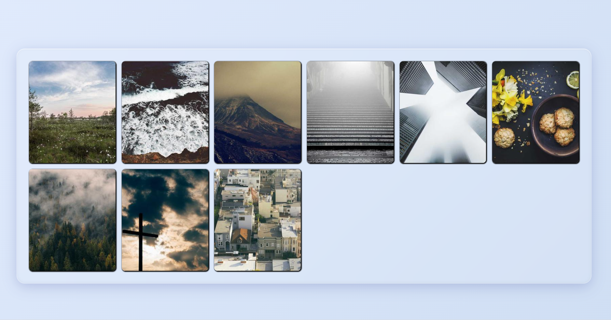

---

## Day 12 — Landing Page Hero Section
**Phase:** 2 (Layouts)
**Status:** ✅ Complete

**Brief:** Build a full-width hero section — headline, subtext, CTA button, background image with dark overlay.

**Requirements:**
- Full viewport width, generous height (`min-height`/`height: 80vh`)
- Genuine `<h1>` headline (correct use this time — main heading of the page)
- Short, punchy subtext (one sentence)
- Prominent CTA button
- Background image with a dark gradient overlay layered on top for text readability
- Content centered both horizontally and vertically

**What was practiced:** stacking a semi-transparent gradient over a background image in one `background-image` property for readable overlay text, using flexbox (`flex-direction: column` + `justify-content: center`) instead of guessed padding values to reliably center a content group vertically, and diagnosing a hover-triggered layout shift caused by a size-changing property (padding) rather than a purely visual one.

**Final result:**

---

## Day 13 — Feature Section (3-column)
**Phase:** 2 (Layouts)
**Status:** ✅ Complete

**Brief:** Build a 3-column "Features" section — icon, title, description per column — using CSS Grid, with a media query to stack to 1 column on smaller screens.

**Requirements:**
- Section heading above 3 feature items
- Each item: icon (emoji), short title, 1-2 sentence description
- `display: grid; grid-template-columns: repeat(3, 1fr);` for equal-width columns
- `@media (max-width: 768px)` to collapse to a single column on narrow screens

**What was practiced:** first real media query (explicit breakpoint-based responsiveness, contrasted with Day 11's automatic `auto-fit`/`minmax()` approach), correct heading hierarchy proactively applied (`<h2>` for section title, `<h3>` per feature item, self-corrected without being asked again after the Day 12 note about `<h1>` usage), continued glassmorphism styling consistency from Day 11.

**Final result:**
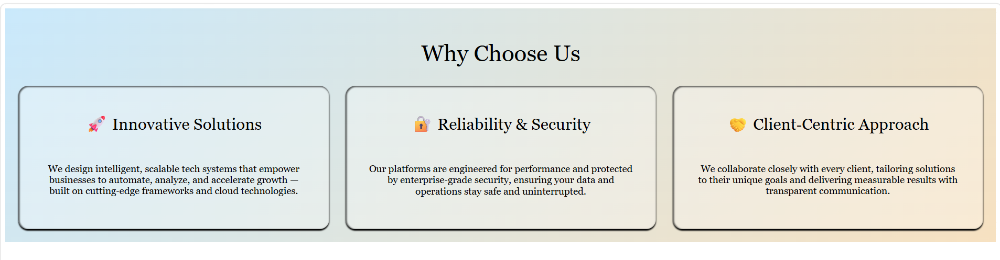

---

## Day 14 — Pricing Table (responsive Grid)
**Phase:** 2 (Layouts)
**Status:** ✅ Complete

**Brief:** Revisit Day 2's pricing cards, rebuilt using CSS Grid instead of flexbox, plus a responsive breakpoint to stack on mobile.

**Requirements:**
- Same 3-tier pricing content as Day 2
- `display: grid; grid-template-columns: repeat(3, 1fr);` for the row layout
- Kept the "middle plan stands out" treatment
- `@media (max-width: 768px)` to stack to a single column
- Reuse/adapt the Day 2 base+modifier CSS structure rather than rewriting from scratch

**What was practiced:** converting an existing flexbox layout to Grid with minimal changes (row-level layout swapped from `display: flex` to `display: grid`, while internal card logic — the `flex-column` + `margin-top: auto` button-alignment trick — carried over unchanged, since that part of the layout was never about the *row*, just the *card's own* internal structure), recognizing when existing work can be adapted rather than rebuilt.

**Notable carryover issue (predates today, not newly introduced):** plan name headings still use `<h1>` × 3 on one page — same semantic issue flagged on Days 12/13, self-identified as worth fixing since the file was already being revisited.

**Final result:**
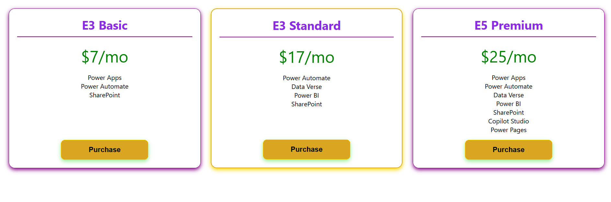

---

## Day 15 — Recipe Card Grid
**Phase:** 2 (Layouts)
**Status:** ✅ Complete

**Brief:** Build a grid of recipe cards (photo, title, meta line) with a contained hover-zoom effect on each image.

**Requirements:**
- 6+ cards in a grid (`auto-fit`/`minmax()` or `repeat(3,1fr)` + media query, either approach)
- Each card: image, title, meta line (time + difficulty)
- Hover zoom on the image that stays clipped within the card — must not spill past rounded corners or push layout

**What was practiced:** the `overflow: hidden` + `border-radius` containment technique applied *dynamically* on hover (versus Day 5's static use of the same trick), and — the key debugging moment — correctly diagnosing why a hover effect applied to the wrong element (`.wrapper:hover { transform }` instead of `.wrapper:hover img { transform }`) "mostly worked" visually (due to a second, coincidental layer of `overflow: hidden` on the parent card) while still being the wrong technique, missing the intended smooth transition, and snapping instantly instead of animating.

**Final result:**
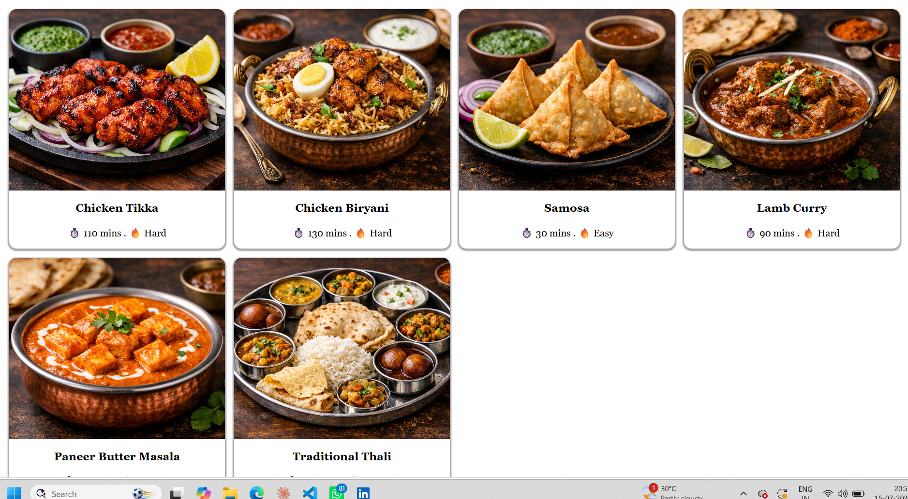

---

## Day 16 — FAQ Accordion (CSS-only)
**Phase:** 2 (Layouts)
**Status:** ✅ Complete

**Brief:** Build a CSS-only expandable FAQ list using native `
`/`
` tags, no JavaScript.

**Requirements:**
- 4-5 FAQ items (8 were built — exceeded the brief)
- Remove default browser marker, add a custom `+`/`-` or arrow indicator
- Each item styled as a clean card/row with hover feedback
- Style differently while open, using the `[open]` attribute selector

**Stretch goal completed:** icon rotates (`+` → rotated `×`) when expanded, via `.faq-item[open] summary::after { transform: rotate(45deg); }`, plus an added box-shadow on open items.

**What was practiced:** the `
`/`
` tag pair (built-in expand/collapse with zero JS), the `[open]` attribute selector for state-based styling without JS, `::-webkit-details-marker` for removing the default disclosure triangle, and diagnosing why `align-items: center` on a flex column caused inconsistent item widths (children shrink to their own content width rather than stretching) — fixed by reverting to `align-items: stretch` (the default).

**Final result:**
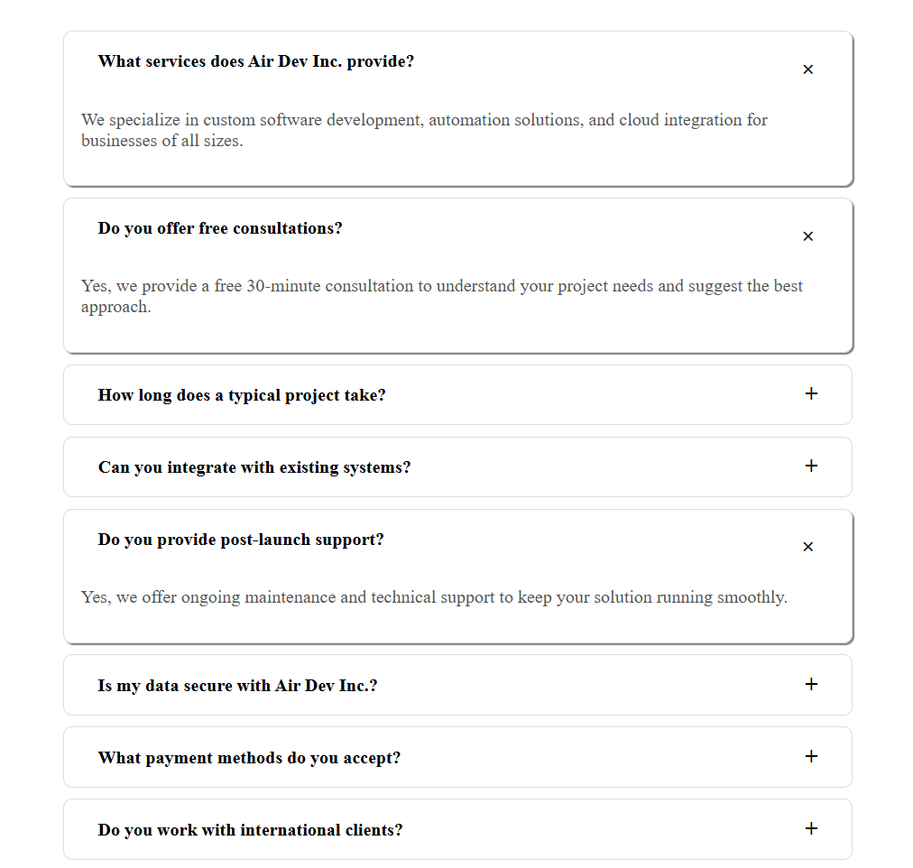

---

## Day 17 — Responsive Navbar with Hamburger (CSS-only)
**Phase:** 2 (Layouts)
**Status:** ✅ Complete

**Brief:** Revisit Day 3's navbar, made responsive — hamburger icon reveals a stacked link menu on narrow screens, entirely CSS-only via the checkbox hack.

**Requirements:**
- Reuse Day 3 navbar styling as the base
- Hidden checkbox + `<label>` hamburger icon, connected via `for`/`id`
- Desktop: normal horizontal navbar, hamburger hidden
- Mobile (`max-width: 768px`): links hidden by default, hamburger visible, tapping reveals a stacked menu via `:checked ~` sibling selector

**What was practiced:** the checkbox-hack toggle pattern (label click → checkbox `:checked` state → sibling selector reveals content, zero JS), the general sibling combinator (`~`) and why HTML source order matters for it (can only select forward to later siblings, not backward), successfully adapting/extending prior work (Day 3) rather than rebuilding from scratch — echoing Day 14's pricing-table adaptation.

**Bug encountered and fixed:** a one-word class name typo (`.menu-nav-link` instead of `.main-nav-link`) in the critical `:checked ~` selector silently broke the entire toggle — a good real-world example of how a single mismatched class name can disable an otherwise-correct interactive mechanism.

**Final result:**
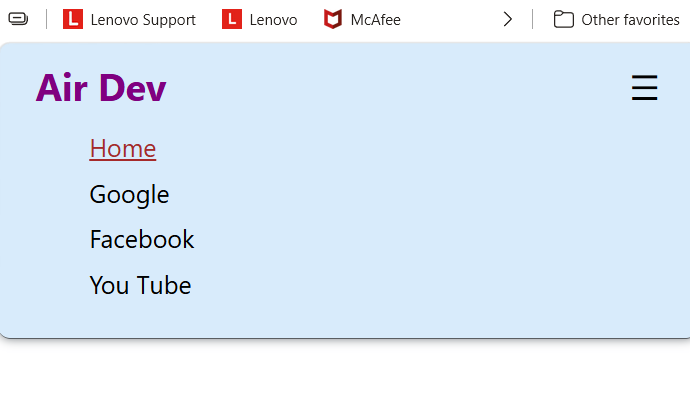

---

## Day 18 — Dashboard Layout (static, sidebar + main)
**Phase:** 2 (Layouts)
**Status:** ✅ Complete

**Brief:** Build a static admin dashboard skeleton — sidebar, topbar, main content — using named CSS Grid areas for the first time.

**Requirements:**
- Sidebar: fixed width, full height, nav links
- Topbar: sits above main content only, not above sidebar
- Main content: remaining space, placeholder widget cards
- `grid-template-areas` to define the layout, `grid-area` on each child
- `height: 100vh` on the outer container

**What was practiced:** `grid-template-areas` (visual text-map layout technique, a name repeated across rows/columns means that area spans those cells), nesting an independent grid (`auto-fit`/`minmax()` for widget cards) inside a single named grid-area of an outer grid, and a real debugging exercise applying Day 17's sibling-selector lesson in a new context — a checkbox nested inside `.topbar` couldn't reveal `.sidebar` via `~` because they weren't siblings (different parents), fixed by moving the checkbox/label to be direct children of `.dashboard` alongside `.sidebar`.

**Bonus (attempted, partially effective):** a semi-transparent backdrop overlay behind the open mobile menu using a `::before` pseudo-element with `position: fixed` — flagged that `z-index: -1` likely pushes it behind the page's own background rather than acting as a visible dim layer; a positive `z-index` (lower than the menu's) would be the correct approach, or making it a real sibling element rather than a pseudo-element.

**Final result:**
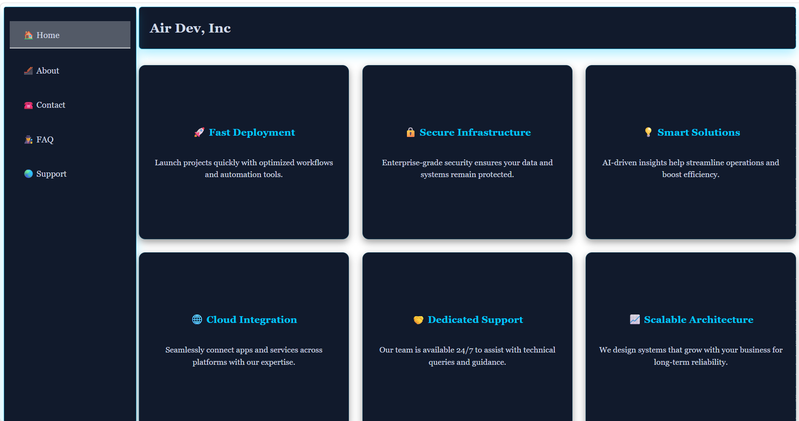

---

## Day 19 — Card Flip Animation
**Phase:** 2 (Layouts)
**Status:** ✅ Complete

**Brief:** Build cards that flip 180° on hover using CSS 3D transforms, revealing a different back face.

**Requirements:**
- 2-3+ flip cards (built as a Power Platform services showcase: Power Apps, Power Automate, Power BI, Power Pages)
- `rotateY(180deg)` flip on hover
- Front/back stacked exactly on top of each other until flipped
- Back face text not mirrored/backwards

**What was practiced (dense, first-time 3D concepts):** `perspective` on the outer wrapper (defines 3D depth strength), `transform-style: preserve-3d` on the rotating element (lets children exist in true 3D space rather than flattening), `backface-visibility: hidden` (hides a face when its rotated-away side faces the viewer, preventing garbled overlap mid-flip), and pre-rotating the back face 180° at rest so it lands right-side-up after the parent's rotation. Also: `box-sizing: border-box` needed on both faces once padding was added, so padded faces stayed exactly the same size and continued to overlap precisely. Fixed a "double-layer" visual bug by moving border/background from the outer `.flip-card` (which never rotates) onto the individual `.flip-card-front`/`.flip-card-back` faces themselves.

**Final result:**
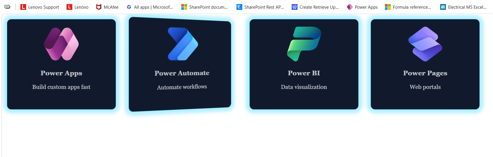

---

## Day 20 — Full Landing Page (Phase 2 Milestone)
**Phase:** 2 (Layouts)
**Status:** ✅ Complete

**Brief:** Integration exercise — combine Day 8 (Footer), Day 12 (Hero), Day 13 (Features), and Day 14 (Pricing) into one cohesive, scrollable landing page. Not a new component; the actual work was reconciling 4 independently-built files into one.

**Requirements:**
- Merge all 4 sections' HTML into one page, in order: Hero → Features → Pricing → Footer
- Merge CSS files, resolving any class-name collisions
- Fix heading hierarchy page-wide: exactly one `<h1>` (hero title), `<h2>` for each section title, `<h3>` for repeating item titles within a section
- Establish one consistent color palette/font across all sections
- Consistent spacing rhythm between sections
- Full top-to-bottom scroll review for cohesion

**Issues found and fixed during review (first pass → corrected):**
- Section titles ("Why Choose Us?", "Our Plans") were `` instead of `<h2>` — fixed
- Feature item titles were `<h2>` (should step down to `<h3>` once section title claimed `<h2>`) — fixed
- Pricing plan names were plain `` — converted to `<h3>` — fixed
- Footer used malformed `<sapn>` tags (×3) instead of ``/`<h4>` — fixed to `<h4>`
- Footer links were plain text, not real `<a>` elements — fixed
- Copyright `` was empty — populated
- Footer wrapper was a generic `
` instead of semantic `<footer>` — fixed
- Typo `fetaure-description` (×7) — fixed to `feature-description`

**Remaining polish flagged (minor, optional):** no "featured plan" visual distinction on the middle pricing card (present in original Day 2/14 versions, lost in the merge); diagonal rather than purely vertical hover lift on feature cards; slightly asymmetric top/bottom padding on the pricing section.

**What was practiced:** the real work of a front-end dev beyond building isolated components — reconciling semantics, fixing heading hierarchy across merged content, resolving/avoiding CSS class collisions between separately-authored stylesheets, and establishing one consistent visual language (color palette, spacing rhythm, card treatment) across previously-independent pieces.

**Final result (scrolled, 3 sections):**
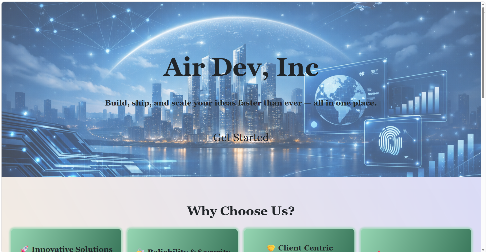
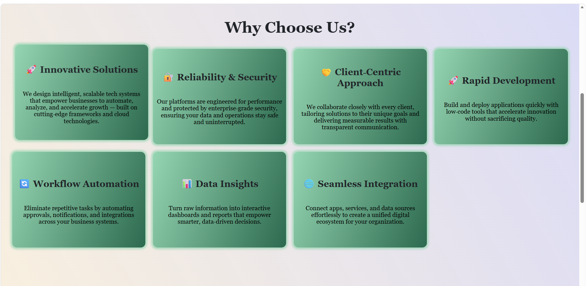
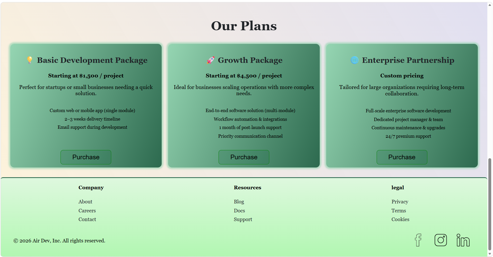

---

## PHASE 2 COMPLETE (Days 11-20) 🎯
All layout techniques covered: CSS Grid (`auto-fit`/`minmax`, `repeat()`, named `grid-template-areas`), media queries, glassmorphism, 3D transforms, the checkbox hack, `
`/`
`, and a full multi-section page integration.

---

## Day 21 — Light/Dark Mode Toggle
**Phase:** 3 (JavaScript — DOM Basics) — first day of real JavaScript
**Status:** ✅ Complete

**Brief:** Build a light/dark mode toggle button — the first genuine JavaScript of the course, applied directly to the real Air Dev site (dev-console redesign from the mid-course UI overhaul) rather than a standalone exercise.

**Requirements:**
- Toggle button (fixed position), icon swaps between states
- Click toggles a `.light-mode` class on `<body>`
- Light-mode CSS overrides defined via the same `:root` custom properties already used site-wide
- No persistence required yet (localStorage comes later, Day 31)

**What was practiced:** `document.querySelector` (finding an element via CSS-selector syntax from JS), `.addEventListener('click', callback)` and arrow function syntax, `.classList.toggle()`/`.classList.contains()` for state-driven class management (the JS equivalent of the `:hover`/`[open]`/`:checked` CSS-only state patterns used throughout Phases 1-2), `if`/`else` conditionals, `.textContent` for reading/writing element text, and `console.log` as a basic "did my code even run" debugging habit.

**Bugs fixed:** a `scr` typo instead of `src` on the `<script>` tag (silently prevented the JS file from loading at all — no console errors, just nothing happening), and a stray `.` inside `classList.toggle('.light-mode')` (JS class-name arguments take the bare name, unlike CSS selectors which require the `.` prefix — a mismatch between CSS selector syntax and JS API syntax that trips up most people the first time). Also fixed `position: absolute` on the toggle button (anchored to `.hero`, scrolled away with the page) → `position: fixed` (anchored to the viewport, stays visible everywhere).

**Payoff validated:** because the entire site was already built on CSS custom properties (`var(--token)`) rather than hardcoded colors back in the redesign, a single `body.light-mode { --bg-deep: ...; }` override block re-themed the whole page — hero, cards, footer — with zero changes needed anywhere else.

---

## Day 22 — Accordion (JS version)
**Phase:** 3 (JavaScript — DOM Basics)
**Status:** ✅ Complete

**Brief:** Build a JS-driven FAQ accordion (converting Day 16's native `
`/`
` version) with only one item open at a time and a smooth expand/collapse animation.

**Requirements:**
- Click toggles an answer open/closed
- Only one item open at a time (closing any previously open item)
- Smooth animation, not an instant snap
- Visual open/closed indicator

**Extra (user-driven, beyond original brief):** a second toggle button (`.showFaq`) to show/hide the *entire* FAQ section (divider + accordion together), reusing a shared `hideFaq()` helper function between both the per-item and whole-section toggle handlers.

**What was practiced:** `querySelectorAll` + `.forEach()` for attaching identical behavior to multiple elements at once, the "capture state before resetting" pattern for correct open/close toggling (checking `isOpen` before clearing all `.active` classes, avoiding the "always reopens" bug), and — critically — three real, distinct bugs debugged in sequence: (1) `:active` pseudo-class mistaken for a custom `.active` class, (2) a class being added to the wrong element (`header` vs `item`) than the one being checked, (3) `max-height` transition being defeated by `display: none`/`block` toggling (same non-animatable-property lesson as Day 18's dropdown menu), ultimately resolved by using `max-height: 0` alone (no `display` toggling) for a genuinely smooth animation.

**Notable code-quality habit:** extracting repeated `forEach(...).classList.remove('active')` logic into a single reusable named function rather than duplicating it — an early example of DRY (Don't Repeat Yourself) practice.

**Final result:**
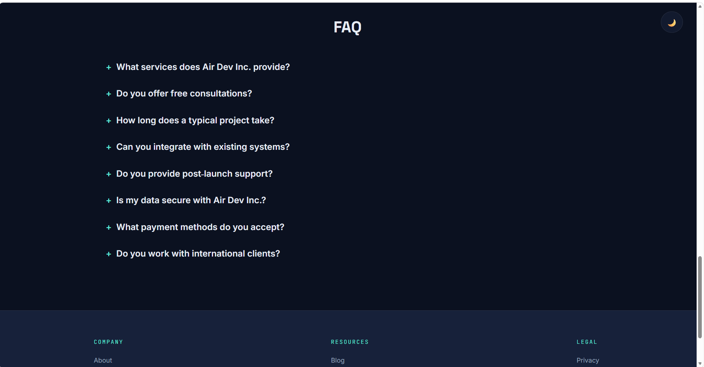

---

## Day 23 — Tabs Component
**Phase:** 3 (JavaScript — DOM Basics)
**Status:** ✅ Complete

**Brief:** Build a tabbed content switcher — click a tab, its content panel shows, others hide. Same underlying pattern as Day 22's accordion (one active item at a time).

**Requirements:**
- 3+ tabs, each with distinct content
- Clicking a tab makes it visually active and shows its matching panel, hiding all others
- Explicit `data-tab`/`data-panel` matching rather than positional/index matching

**Incorporated directly into the real site (user request):** placed as a new "How We Work" process section between Features and Pricing, styled as IDE-style file tabs (`discover.js`, `design.js`, `develop.js`, `deploy.js`) to extend the existing developer-console theme — required renumbering all subsequent `// 0N SECTION` dividers.

**What was practiced:** `data-*` custom attributes and `.dataset` in JS (`data-tab="design"` in HTML ↔ `btn.dataset.tab` in JS, hyphenated HTML attribute names become camelCase JS properties), template literals (backticks + `${...}`) for building a dynamic selector string — and *why* regular quotes silently fail to interpolate.

**Real debugging chain (4 distinct bugs, resolved in sequence):**
1. `querySelector` used instead of `querySelectorAll` (only grabbed the first tab button/panel)
2. Missing backticks — `${target}` inside regular quotes is treated as literal text, not substituted
3. Missing leading `.` on the class selector inside the template literal
4. A `data-tab`/`data-panel` spelling mismatch (`develope`/`deploye` vs `develop`/`deploy`) on two of the four tabs

**Final, trickiest bug — stale/cached script file:** after all *visible* code bugs were fixed and the code read as fully correct, clicks still didn't fire. Diagnosed via a structured elimination process (checking whether *other* JS on the page still worked — it did, ruling out a fatal syntax error; manually checking `querySelectorAll(...).length` in console — correct count, ruling out missing elements) that narrowed it to the browser running an outdated cached version of `script.js` rather than the actual saved file. Resolved by renaming and re-adding the script file, forcing a fresh load. A genuinely valuable real-world lesson: code that is correct on the page can still fail to run if the browser isn't actually executing your latest saved version.

**Final result:**
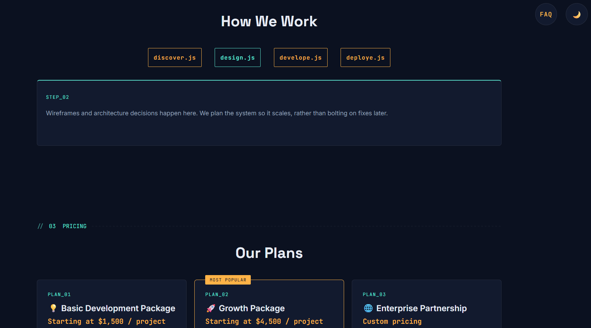

---

## STANDING INSTRUCTION (set during Day 24)
From this point forward, every exercise is designed to be embedded directly into the real Air Dev site (same dev-console design system) rather than built as a standalone/throwaway file — reflects the user's explicit request to keep building toward one real, growing site rather than 45 disconnected practice pages.

---

## Day 24 — Character Counter
**Phase:** 3 (JavaScript — DOM Basics)
**Status:** ✅ Complete

**Brief:** A textarea with a live character count, warning color near the limit — first exercise responding to typing (`input` event) rather than clicks.

**Requirements:**
- Live `X / 280` count updating on every keystroke
- Visual warning state approaching the limit
- Typing prevented past the limit (`maxlength` HTML attribute)

**Incorporated directly into the real site:** built as a full "Get In Touch" contact section (Name/Email/Message form) — a new `05 CONTACT` section between FAQ and the footer, continuing the dev-console theme.

**What was practiced:** the `input` event (fires on every keystroke/paste/delete, unlike `click`), `.value` (reading text from form fields) vs `.textContent` (reading/writing visible text of regular elements) as two distinct properties for two different element categories, `else if` for a three-way conditional branch, and `element.style.property` for setting inline styles directly from JS (with `''` resetting to the stylesheet default).

**Bug caught during review:** the form's "Thank you" confirmation was attached to the submit *button's* `click` event only — missed the common case of submitting a form by pressing Enter in a text field, which triggers the browser's native `submit` event without ever firing a `click` on the button. Fixed by moving the listener to `form.addEventListener('submit', ...)` instead, which catches both interaction paths through one shared underlying event.

**Final result:**
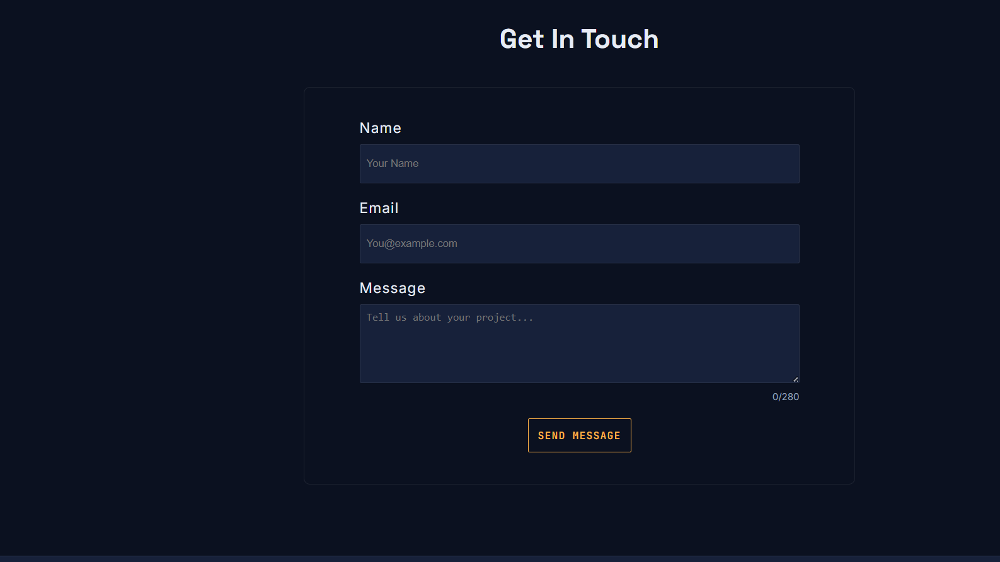

---

## Day 25 — To-Do List (basic, no storage)
**Phase:** 3 (JavaScript — DOM Basics)
**Status:** ✅ Complete

**Brief:** Add/display/remove list items dynamically — first exercise creating new DOM elements from JS rather than toggling existing ones. No persistence yet (localStorage comes Day 31).

**Requirements:**
- Add items via input + button
- Display added items in a list
- Remove individual items
- (Stretch, included) mark items done via strikethrough

**Incorporated directly into the real site:** built as a "Live Demo" section — a browser-window-framed interactive product preview (traffic-light dots, `air-dev-tasks.app` title bar) placed between Features and Process, following the common SaaS-marketing-page pattern of embedding a working mini version of the actual product rather than just describing it.

**What was practiced:** `document.createElement()` (building new elements entirely in memory), `.innerHTML` (inserting markup, not just text, contrasted with `.textContent`), `.appendChild()` (actually inserting a created element into the visible page), `.trim()` (guarding against whitespace-only input), and **event delegation** — attaching one listener to the parent list rather than individual listeners to each (dynamically-created, not-yet-existing-at-page-load) remove button, using `e.target` inside the handler to identify what was actually clicked, plus `.closest()` to walk up from a clicked button to its containing list item.

**Final result:**
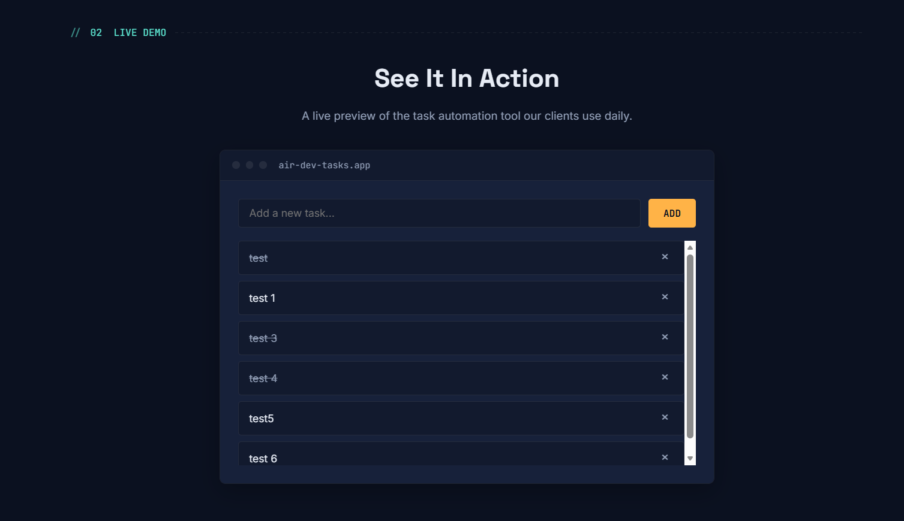

---

## Day 26 — Image Slider/Carousel
**Phase:** 3 (JavaScript — DOM Basics)
**Status:** ✅ Complete (self-initiated — user built this ahead of the brief being given)

**Brief (inferred from the original 45-day plan by the user):** next/prev buttons cycle through images, dot indicators, auto-play.

**Incorporated directly into the real site:** reframed as a "Client Success Stories" testimonial carousel (section `05`) between Pricing and FAQ (required renumbering FAQ → 06, Contact → 07, handled correctly without prompting) — a stronger, more realistic business framing than a generic photo slider.

**Requirements delivered:** Prev/Next buttons with wraparound (modulo-based looping in both directions), clickable dot indicators, continuous auto-play via `setInterval`, active-slide fade-in.

**Real bugs found and fixed during review:**
1. **Three separate, unsynced "current slide" state variables** (`currentSlideIndex` for prev/next, an undeclared implicit-global `slideIndex` for dot clicks, and a separate `currentIndex` for auto-play) — each interaction path tracked its own copy of "which slide is active," causing the slider to visually jump/desync depending on which controls were used in what order. Fixed by consolidating to one shared `currentSlideIndex`, updated from inside a single `showSlideToggle()` function that every trigger (buttons, dots, auto-play) calls through.
2. **Invalid CSS:** `transition: fade 0.5s ease;` — `transition` requires an actual CSS property name as its target, not a `@keyframes` name; `fade` is neither, so the rule was silently ignored and the intended fade-in animation never played. Fixed by switching to `animation: fade 0.5s ease;`, the correct property for invoking a named keyframe sequence.
3. **`.childNodes` vs `.children`:** used `.childNodes` to collect the dot elements, which includes text nodes (e.g. whitespace) in addition to actual elements — worked only by coincidence because the HTML source had zero whitespace between the `` dot elements; fragile against future reformatting. Switched to `.children`, which only ever returns element nodes.

**What was practiced well (first attempt, no prompting needed):** modulo-based wraparound indexing for cyclical navigation in both directions, the two-argument form of `classList.toggle(class, condition)` to force a state rather than blindly flip it, and independently propagating a structural change (new section) through all dependent numbering elsewhere on the page.

**Final result:**
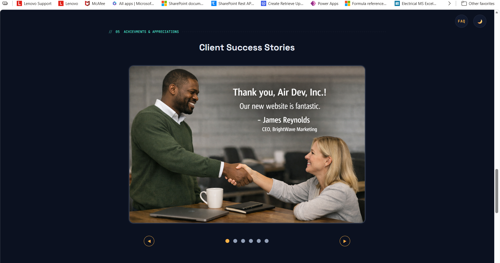

---

## Day 27 — *(upcoming)*
*To be filled in when started.*
