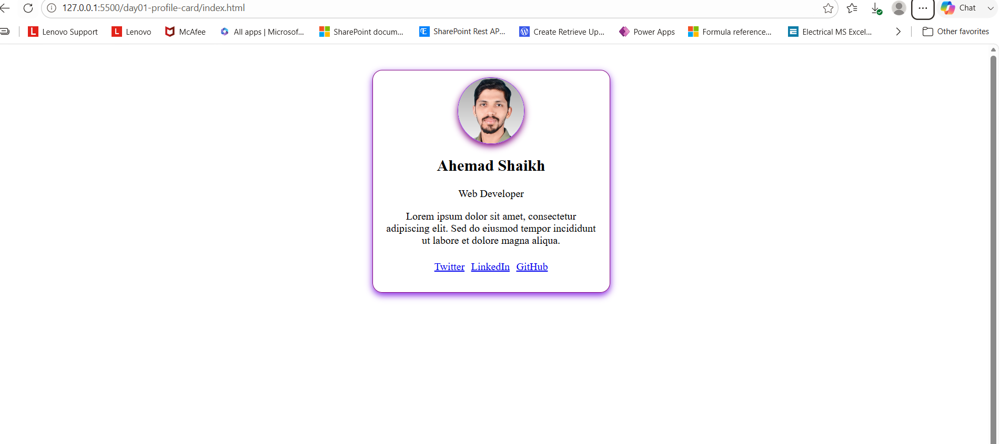
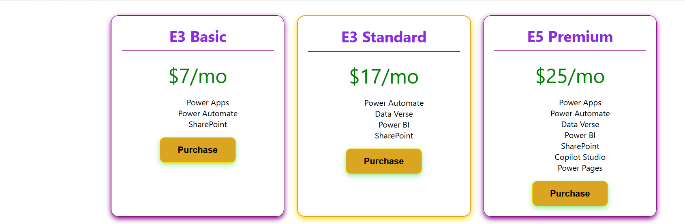
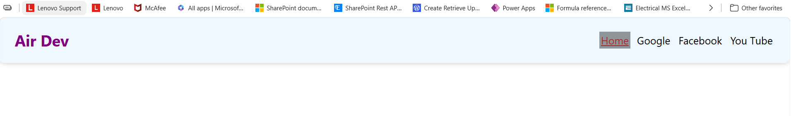
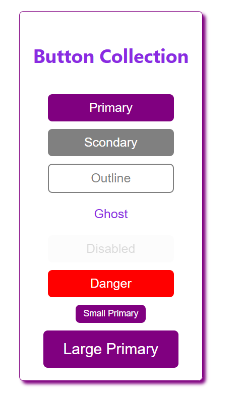
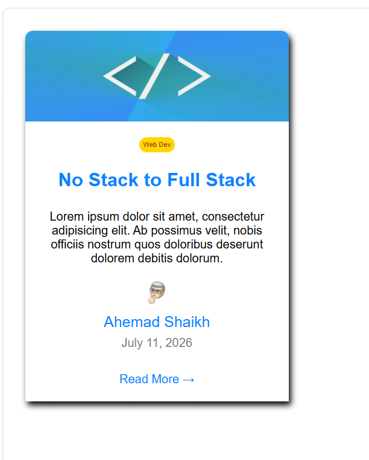
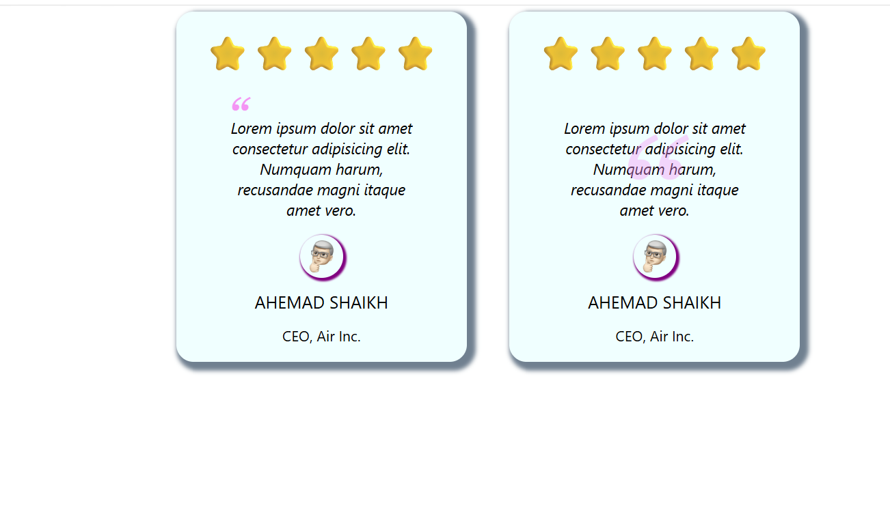
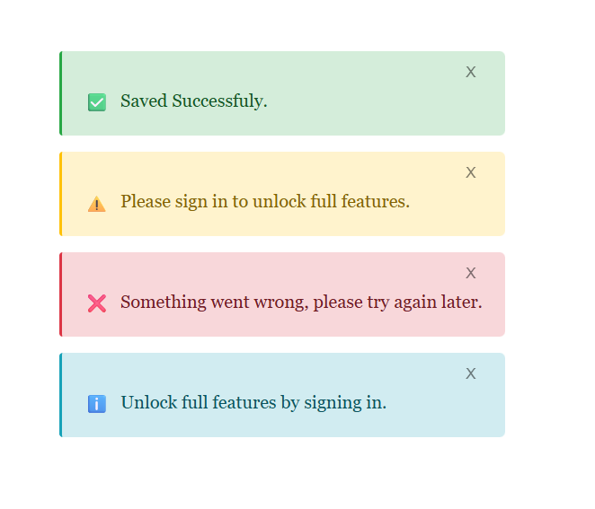
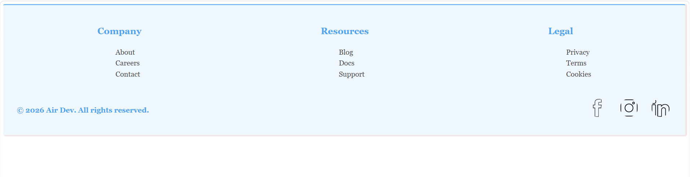
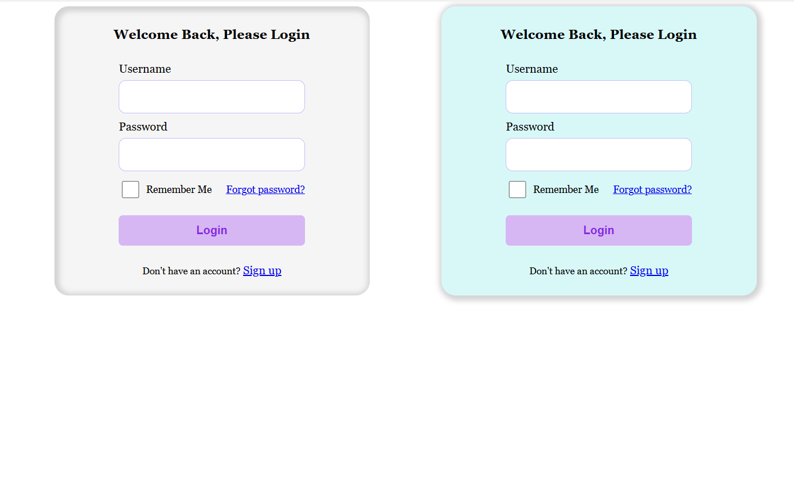
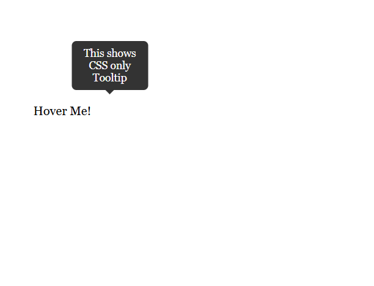

# Daily Task Briefs — Web Dev Practice

This file logs the exact brief/requirements given for each day, as a reference record. Updated after each completed day.

---

## Day 1 — Profile Card
**Phase:** 1 (HTML + CSS only)
**Status:** ✅ Complete

**Brief:** Build a card showing a profile picture, name, short bio, and 3-4 social icons/links.

**Requirements:**
- Semantic HTML (`<article>` or `<section>`, not just `
` soup)
- Circular profile image (`border-radius: 50%`)
- Name as a heading, bio as a paragraph
- Social links row at the bottom
- Card: padding, subtle box-shadow, rounded corners, max-width
- Center the card on the page

**Stretch goals:** hover lift effect (`transform: translateY(-4px)` + `box-shadow`), gradient/border behind image.

**Final result:**

---

## Day 2 — Pricing Card
**Phase:** 1 (HTML + CSS only)
**Status:** ✅ Complete

**Brief:** Build 3 pricing cards side by side (Basic / Standard / Premium) using flexbox.

**Requirements:**
- Container holding 3 `.pricing-card`-style elements, `display: flex` + `gap`
- Each card: plan name, price, feature list (`<ul>`), "Choose Plan" button
- Middle/highlighted card visually distinct (border color, scale, or badge)
- Consistent card widths (`flex: 1` or fixed width)
- Responsive: `flex-wrap: wrap` for smaller screens

**What was practiced:** flexbox for row + internal card layout, visual hierarchy, shared class + modifier pattern (`.plan-name`, `.plan-price` reused across all 3 cards), flex-column + `margin-top: auto` for pinning buttons to card bottom regardless of content height, CSS specificity when two rules conflict.

**Final result:**

---

## Day 3 — Navbar
**Phase:** 1 (HTML + CSS only)
**Status:** ✅ Complete

**Brief:** Build a horizontal navbar — logo on the left, nav links on the right, with hover states.

**Requirements:**
- `<nav>` element (semantic)
- Logo/site name on the left
- 4-5 links on the right (`<ul><li><a>` pattern)
- `display: flex` + `justify-content: space-between` on `<nav>`
- Hover effect on links
- Bottom border or box-shadow separating navbar from page

**Stretch goal:** an "active" link style to simulate current-page indicator — done via a `.default` class + specificity fix.

**Final result:**

---

## Day 4 — Button Collection
**Phase:** 1 (HTML + CSS only)
**Status:** ✅ Complete

**Brief:** Build a reference sheet of 6-8 button styles (primary, secondary, outline, ghost, disabled, danger).

**Requirements:**
- Shared base class `.btn` (padding, border-radius, font-size, cursor, transition)
- Modifier classes for each variant on top of `.btn`
- Real `disabled` HTML attribute (not just a class) for the disabled button, styled via `:disabled`
- Hover + transition on all non-disabled buttons

**Stretch goal completed:** size variants `.btn-sm` / `.btn-lg`, combinable with color variants (e.g. `btn btn-primary btn-sm`) — required removing the fixed `width` from base `.btn` so size modifiers could take effect.

**Final result:**

---

## Day 5 — Blog Post Card
**Phase:** 1 (HTML + CSS only)
**Status:** ✅ Complete

**Brief:** Build a blog post preview card — thumbnail, badge/tag, title, excerpt, author/date row, "Read more →" link.

**Requirements:**
- Full-width thumbnail image, rounded to match card
- Small colored badge/tag label
- Title (proper heading level, not `<h1>`)
- 2-3 line excerpt
- Author + date row with small circular avatar, laid out with flexbox
- "Read more →" link with hover state

**Extra (user-driven, beyond original brief):** positioned the badge absolutely in the top-right corner over the thumbnail image, using `position: relative` on the card + `position: absolute` on the badge.

**Final result:**

---

## Day 6 — Testimonial Card
**Phase:** 1 (HTML + CSS only)
**Status:** ✅ Complete

**Brief:** Build a customer testimonial card — quote, star rating, author name/photo/title.

**Requirements:**
- Star rating row (plain text/unicode stars, styled with color)
- Quote using the semantic `<blockquote>` tag
- Decorative large quote mark via a `::before` pseudo-element (not typed into HTML content)
- Author row: circular avatar, bold name, muted title/company
- Standard card treatment (padding, rounded corners, shadow)

**Extra (user-driven, beyond original brief):** turned the small decorative quote mark into a large, faded "watermark" sitting behind the entire quote text, using oversized font-size + low opacity + `z-index` stacking + the `top/left: 50%` + `transform: translate(-50%, -50%)` centering trick.

**Final result:**

*(watermark quote effect, before the final -25% vertical nudge described in the notes file)*

---

## Day 7 — Alert / Notification Boxes
**Phase:** 1 (HTML + CSS only)
**Status:** ✅ Complete

**Brief:** Build 4 alert/notification box variants — success, error, warning, info.

**Requirements:**
- Icon + message per box, laid out with flexbox
- Base class (`.alert`) + modifier classes per type (`.alert-success`, `.alert-warning`, `.alert-error`, `.alert-info`)
- Light background tint + matching border + darker text color per type
- Optional close ("✕") button, non-functional for now (JS added in a later phase)

**Notable deviation (an improvement):** used `border-left` as an accent instead of a full border around the box — closer to real-world alert component patterns (e.g. Bootstrap-style alerts). Close button placed via `flex-direction: column` + `align-self: flex-end` rather than `justify-content: space-between`, which reads better for variable-length messages.

**Final result:**

---

## Day 8 — Simple Footer
**Phase:** 1 (HTML + CSS only)
**Status:** ✅ Complete

**Brief:** Build a multi-column footer with grouped links and a copyright line.

**Requirements:**
- Semantic `<footer>` wrapper (not `
`)
- 3-4 columns, each with a heading + list of links (`<ul><li><a>`)
- Columns laid out side-by-side with flexbox
- Bottom row separated from columns (e.g. `border-top`), with copyright text
- Hover effect on links
- Visually distinct footer background from the page

**Stretch goal completed:** social icons (actual images, not emoji) in the bottom row, with a hover lift effect (`translateY` + background + shadow) added beyond the brief.

**Notable deviation (a legitimate design choice):** used a light blue background rather than the traditional dark footer — a deliberate stylistic choice to stay consistent with the light color scheme used across other cards.

**Final result:**

---

## Day 9 — Login Form (static)
**Phase:** 1 (HTML + CSS only)
**Status:** ✅ Complete

**Brief:** Build a static login form — no JS validation yet, just structure and styling.

**Requirements:**
- Real `<form>` element wrapping the inputs
- Each field wrapped with a properly connected `<label for="...">` matching `<input id="...">`
- Correct input `type` (`email`/`text` for username, `password` for password)
- "Remember me" checkbox + "Forgot password?" link on the same row (flexbox)
- Full-width, prominent submit button
- Visible `:focus` states on inputs (not just relying on browser default)
- Card container consistent with other cards (padding, rounded corners, shadow, centered)

**What was practiced:** `for`/`id` label-input relationships (and why duplicate `id`s break this), input `:focus` styling as an accessibility requirement (never remove the default outline without a visible substitute), semantic tag choice for clickable text (`<a>` vs ``/`<strong>`).

**Final result:**

---

## Day 10 — CSS-only Tooltip
**Phase:** 1 (HTML + CSS only) — final day of Phase 1
**Status:** ✅ Complete

**Brief:** Build a hover-triggered tooltip using only CSS, no JavaScript.

**Requirements:**
- Trigger element + hidden-by-default tooltip box
- Tooltip appears on hover, positioned above the trigger
- Smooth fade-in via `opacity` + `transition` (not abrupt show/hide)
- Small triangular arrow pointing from tooltip to trigger, built with the CSS border-triangle trick
- 2-3 tooltips practicing the pattern (brief allowed doing just one to focus on getting the technique right first)

**What was practiced:** the hover-reveal descendant-selector pattern (`.wrapper:hover .child`), why hovering the *wrapper* rather than the trigger avoids a flicker bug when the mouse moves from trigger into the tooltip itself, `opacity` + `visibility` combined for animatable show/hide, and the CSS triangle trick (zero-size element + one visible border side + three transparent sides).

**Final result:**

---

## PHASE 1 COMPLETE (Days 1-10) 🎯
All HTML + CSS-only components built: Profile Card, Pricing Card, Navbar, Button Collection, Blog Post Card, Testimonial Card, Alert Boxes, Footer, Login Form, CSS-only Tooltip.

---

## Day 11 — *(upcoming, Phase 2: Layouts)*
*To be filled in when started.*
